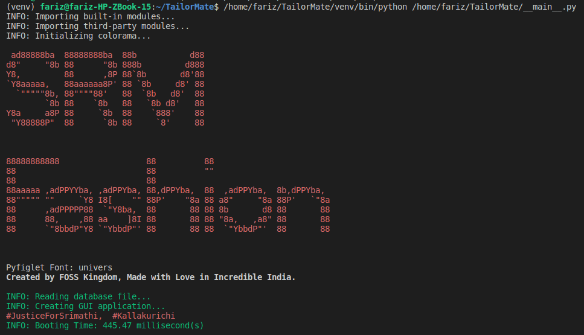

# TailorMate

Free and open source app for tailoring shop and boutique to manage order, measurement, customers. TailorMate app is a CRM (Customer Relationship Management) and order management solution designed for Tailoring shops and Boutiques.

Now you can get rid of your old paper-based registers. Let us go digital, by impressing your customers with the new digital order management system, you will get a lot of new business. Be ahead of your competitors.

___

## Features

* Create, modify or delete customers with Name, Phone, Email, Date of Birth, etc.
* Search customers by their name, contact number and email address.
* Monitor your stats reports anytime.

___

### Note that Python 3.9+ cannot be used on Windows 7 or earlier

___

## Open Source Third-party modules

* bcrypt (<https://github.com/pyca/bcrypt/>)
* colorama (<https://github.com/tartley/colorama>)
* cryptography (<https://github.com/pyca/cryptography>)
* darkdetect (<https://github.com/albertosottile/darkdetect>)
* email-validator (<https://github.com/JoshData/python-email-validator>)
* phonenumbers (<https://github.com/daviddrysdale/python-phonenumbers>)
* pillow (<https://python-pillow.org/>)
* psutil (<https://github.com/giampaolo/psutil>)
* pyfiglet (<https://github.com/pwaller/pyfiglet>)
* requests (<https://requests.readthedocs.io/en/latest/>)
* tkcalendar (<https://github.com/j4321/tkcalendar>)
* ttkthemes (<https://github.com/TkinterEP/ttkthemes>)

___

## Gallery

___

___

___

___

___

___

___

___

___

___

___

___

## Credits

* [Sewing icons created by ultimatearm - Flaticon](https://www.flaticon.com/free-icons/sewing)
* [Target icons created by Freepik - Flaticon](https://www.flaticon.com/free-icons/target)
* [Search icons created by Icon home - Flaticon](https://www.flaticon.com/free-icons/search)
* [Add icons created by Freepik - Flaticon](https://www.flaticon.com/free-icons/add)
* [Edit icons created by Pixel perfect - Flaticon](https://www.flaticon.com/free-icons/edit)
* [Delete icons created by Andrean Prabowo - Flaticon](https://www.flaticon.com/free-icons/delete)
* [Save icons created by Freepik - Flaticon](https://www.flaticon.com/free-icons/save)
* [License icons created by Freepik - Flaticon](https://www.flaticon.com/free-icons/license)
* [Code icons created by Freepik - Flaticon](https://www.flaticon.com/free-icons/code)
* [Bug icons created by Freepik - Flaticon](https://www.flaticon.co/free-icons/bug)
* [Website icons created by Freepik - Flaticon](https://www.flaticon.com/free-icons/web-site)
* [Stain icons created by Freepik - Flaticon](https://www.flaticon.com/free-icons/stain)
* <a href="https://www.flaticon.com/free-icons/close" title="close icons">Close icons created by Chanut - Flaticon</a>
* [Calendar icons created by Pixel perfect - Flaticon](https://www.flaticon.com/free-icons/calendar)
* [Login icons created by Pixel perfect - Flaticon](https://www.flaticon.com/free-icons/login)
* [Logout icons created by Pixel perfect - Flaticon](https://www.flaticon.com/free-icons/logout)
* [Tick icons created by Kiranshastry - Flaticon](https://www.flaticon.com/free-icons/tick)
* [Package delivered icons created by sonnycandra - Flaticon](https://www.flaticon.com/free-icons/package-delivered)
* [Share icons created by IconKanan - Flaticon](https://www.flaticon.com/free-icons/share)
* [Facebook's icons created by Freepik - Flaticon](https://www.flaticon.com/free-icons/facebook)
* [Instagram's icons created by Freepik - Flaticon](https://www.flaticon.com/free-icons/instagram)
* [LinkedIn's icons created by Freepik - Flaticon](https://www.flaticon.com/free-icons/linkedin)
* [Reddit's icons created by Freepik - Flaticon](https://www.flaticon.com/free-icons/reddit)
* [Twitter social badge icons created by Freepik - Flaticon](https://www.flaticon.com/free-icons/twitter-social-badge)
* [Whatsapp icons created by Freepik - Flaticon](https://www.flaticon.com/free-icons/whatsapp)
* [YouTube's icons created by Freepik - Flaticon](https://www.flaticon.com/free-icons/youtube)
* [Next icons created by Bharat Icons - Flaticon](https://www.flaticon.com/free-icons/next)

___
